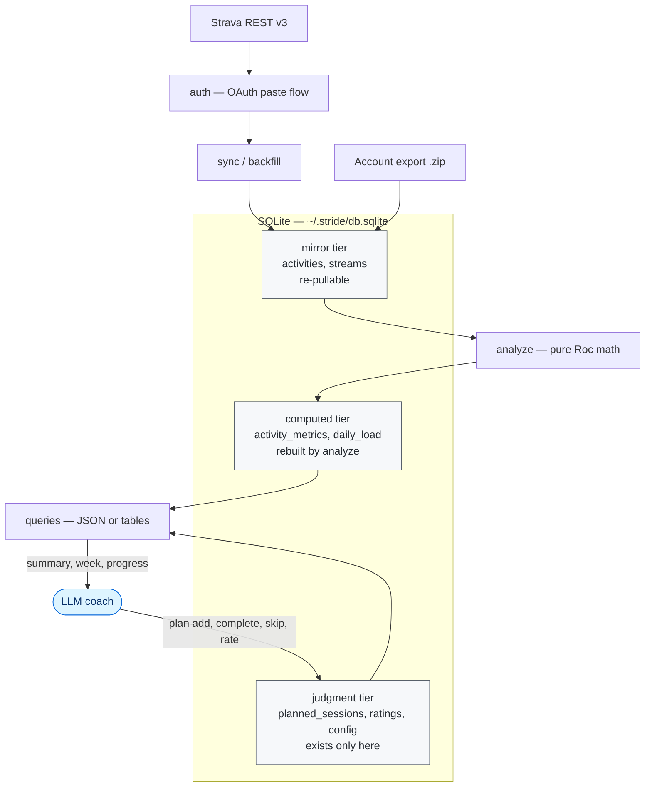

<p align="center">
  
</p>

# stride

stride answers the training questions Strava doesn't — is my training actually
polarized, is my fitness climbing, when was my last *real* hard session, is my FTP
stale — from your own Strava history, computed locally into a SQLite file you own.
Optional LLM coaching layer on top.

Local-first and deterministic, written in [Roc](https://www.roc-lang.org): Strava is
one ingestion layer, the analysis is yours.

> **The engine does the math. The LLM does the judgment.**

```bash
$ stride summary

── stride report (as of 2026-07-31) ──────────────────

  fitness (CTL): 25   fatigue (ATL): 25   form (TSB): 0
  → form 0, level with a week ago — balanced

  last 28 days:
    training load: 819 (79% measured — rest estimated from HR/RPE; see doctor)
    time in HR zones: Z1 409m  Z2 189m  Z3 276m  Z4 72m  Z5 0m
    polarization: 63% easy (Z1-2) / 29% moderate (Z3) / 8% hard (Z4-5)
    ⚠ zone gap: no Z5 heart-rate time in 28 days (could be no hard sessions, or
      power-based / short intervals that didn't drive HR to Z5)

  FTP (60d): ~243W — derived from your best 20-min power 256W

  last 7 days: 208 load — 40% easy / 46% moderate / 14% hard
  last hard session (5+ min Z4/Z5): 2026-07-28
  open planned sessions: 3
```

Every number above was computed locally from your raw activity streams — none came
from a model. "Training load" is a *mixed model*: power/HR sessions score in TSS,
rated strength/HIIT sessions in session-RPE, so stride stops calling the blended
total "TSS" and `doctor` breaks it down by per-session confidence.

**What you'll need:** a terminal and `sqlite3`. For your data, two paths — the free
**account export** (`stride import`, no API app and no Strava subscription) for
summary-level history, or your own **Strava API app** for live daily sync and full
stream history (that path needs an active Strava subscription to hold API
credentials). Either way stride is a command-line tool and a personal daily-driver,
not a hosted service or a phone app; first-time setup is about ten minutes.

## Why stride, if I already have Strava?

**Strava records activities. stride explains training.**

Strava is the system of record; stride is the analysis layer on top of it. Where they
differ:

- **Deterministic metrics** — TSS, normalized power, intensity factor, CTL/ATL/TSB,
  time-in-zone, derived per-sport FTP. Same inputs, same numbers, every time.
- **A database you own** — everything lives in `~/.stride/db.sqlite`. Query it with
  `sqlite3`, back it up with `cp`, inspect any computed value's inputs, and read it
  offline after a sync. It also holds your Strava tokens and client secret, so stride
  locks `~/.stride` to `0700` and the db to `0600` (owner-only) on every run, and
  `config get` never prints secret keys.
- **Reproducible recomputation** — every metric records the inputs it was computed from,
  so a changed input recomputes exactly the affected history. Edit a ride on Strava and
  the metrics self-heal.
- **Scriptable** — every command emits JSON for tools and agents, tables for humans,
  in a versioned envelope a caller can depend on (shape under [Commands](#commands)).
- **An honest data model** — a session with no usable data shows `-`, not an
  invented number. Junk HR samples are filtered, and it says so. Strength, HIIT,
  and yoga score through your own effort rating (`stride rate`) instead of
  pretending an aerobic model fits them — and every computed load records both
  which method produced it and a **confidence tier** (high = measured power,
  medium = HR or session-RPE, low = Strava relative effort), which `doctor`
  reports as a distribution so you know how much of your load is measured vs
  estimated.

## Installation

Everyone needs `sqlite3`. Then pick a data path:

- **API sync (fullest data — live daily sync + full streams):** a
  [Strava API application](https://www.strava.com/settings/api) (client ID +
  secret — takes two minutes to create). Note: since June 2026, Strava requires
  an active Strava subscription to hold API credentials
  ([their announcement](https://communityhub.strava.com/insider-journal-9/an-update-to-our-developer-program-13428)).
- **Account export (free, no API app):** `stride import <export.zip>` loads the
  archive Strava emails you from Settings → My Account → Download or Delete Your
  Account. Summary-level data today; stream import is tracked in
  [#6](https://github.com/eschizoid/stride/issues/6).

### Prebuilt binary (recommended)

Grab the binary for your platform from the [latest release](https://github.com/eschizoid/stride/releases/latest)
and put it on your `PATH`. Pick one:

| Platform | Asset |
| --- | --- |
| Linux · x86_64 | `stride-linux-x86_64` |
| macOS · Apple Silicon | `stride-macos-arm64` |
| macOS · Intel | `stride-macos-x86_64` |
| Linux · arm64 | `stride-linux-arm64` |
| Windows · x86_64 | `stride-windows-x86_64.exe` |

```bash
# example: macOS Apple Silicon — adjust the asset for your platform
curl -fsSL -o stride https://github.com/eschizoid/stride/releases/latest/download/stride-macos-arm64
chmod +x stride
sudo mv stride /usr/local/bin/          # or anywhere on your PATH (e.g. ~/.local/bin)
stride --version
```

Verify the download against [`SHA256SUMS.txt`](https://github.com/eschizoid/stride/releases/latest/download/SHA256SUMS.txt)
if you like:

```bash
curl -fsSLO https://github.com/eschizoid/stride/releases/latest/download/SHA256SUMS.txt
sha256sum -c SHA256SUMS.txt --ignore-missing   # checks the asset(s) you downloaded
```

### Build from source

Needs the pinned Roc toolchain (see [Development](#development)) and `just`:

```bash
git clone https://github.com/eschizoid/stride.git && cd stride
just install        # builds the binary, symlinks it into ~/.local/bin
```

## Quick start

```bash
stride init                                   # create + migrate the db
STRAVA_CLIENT_ID=... STRAVA_CLIENT_SECRET=... stride auth   # one-time browser paste flow
stride config set hr_z1_max 120               # your HR zone upper bounds...
stride config set hr_z2_max 150
stride config set hr_z3_max 165
stride config set hr_z4_max 180               # (z5 = everything above)
stride config set timezone America/Chicago    # optional: anchor "today" to your
                                              # local day (not UTC's). An IANA name
                                              # stays DST-correct automatically.
                                              # Fixed alternative, no DST tracking:
                                              #   stride config set utc_offset_minutes -300
                                              # Precedence: timezone > offset > UTC.
                                              # `stride doctor` shows which is active.
stride backfill                               # pull all activities + all stream history
stride analyze                                # compute everything
```

**On the free path (no API app)?** Replace `auth` + `backfill` with a one-shot import
of your Strava account export — `config` and `analyze` are identical:

```bash
stride init
stride import ~/Downloads/strava_export.zip   # summary-level history, no API app
stride config set hr_z1_max 120                # + the rest of the HR zones + timezone, as above
stride analyze
```

`backfill` (API path) is the whole first-time pull: it fetches your complete activity
list, then drains every activity's raw streams, pacing itself against Strava's rate
limits (fills each 15-min window, sleeps to the next, stops cleanly at the daily
cap). It's resumable — a multi-thousand-activity history spans a few days of
`stride backfill` re-runs, hands-off.

After `auth`, credentials live in the db — no env vars ever again. Day-to-day:

```bash
stride sync && stride analyze && stride summary   # the daily loop (repo: `just up`)
stride plan                                       # everything needed to plan a week
```

## Commands

**Setup (once)**

| Command | What it does |
| --- | --- |
| `init` | Creates `~/.stride/db.sqlite` and runs migrations. Idempotent — safe to re-run anytime. |
| `auth` | One-time Strava OAuth: prints an authorize URL, you paste back the `code=` param. Stores tokens *and* client credentials in the db — no env vars needed afterward. |
| `config set <key> <val>` / `config get <key>` | Your numbers: HR zone bounds `hr_z1_max`…`hr_z4_max`, and either `timezone` (IANA, DST-aware) or `utc_offset_minutes` (fixed) to anchor "today". FTP is **not** configured — each sport derives its own from your power history. |

**Data (daily)**

| Command | What it does |
| --- | --- |
| `sync` | Pulls new activities + the next batch of HR/power streams. Re-pulls a rolling 30-day window so edits made on Strava self-heal. The fast daily command. |
| `backfill` | Re-pulls the **full** activity list, then drains **all** missing stream history — hands-off, resumable, paced on Strava's rate-limit headers. First-time imports and deep reconciles (~after bulk edits older than 30 days). |
| `rate <activity_id\|latest> <1-10>` | *How hard did it feel?* Session-RPE (Borg): you are the sensor for strength, HIIT, and yoga. `load = hours × RPE × 10`, so an hour at RPE 10 = 100, TSS-comparable. For strength-class sports your rating outranks HR; for endurance, measured power/HR always win. |
| `import <zip\|dir>` | Loads a **Strava account export** (the ZIP from Settings → My Account → Download or Delete Your Account) — **no API credentials or subscription needed**. Summary-level data (no streams yet, so zone breakdowns stay honestly absent); re-import is idempotent. English-language exports only. |
| `analyze` | Computes metrics for new (or invalidated) activities — TSS, time-in-zone, normalized power — then rebuilds the daily fitness/fatigue/form series through today. Prints what it did plus a one-line form verdict. |

**Reading your training** (each answers a different question)

| Command | The question it answers |
| --- | --- |
| `summary` | *Where do I stand today?* Form (with verdict), 7-day and 28-day zone mix + polarization, your derived FTP and the 20-min best behind it, date of your last hard session, per-sport breakdown. |
| `activities [n] [sport]` | *What did each session actually contain?* Last *n* sessions (default 30), optionally filtered by sport family (human words widen: `bike` = Ride/VirtualRide/GravelRide/MountainBikeRide, `run` = Run/VirtualRun/TrailRun; e-bikes excluded; other sport_types filter exactly) (`activities 10 rowing`). Per session: load, intensity vs FTP, and minutes actually spent hard (Z4+Z5). |
| `top <metric> [n] [sport]` | *What were my best sessions?* Ranks activities (default top 10) by a metric — `hr`, `tss`, `power`, `intensity`, `distance`, `time`, or `output` (kJ) — optionally filtered by sport (`top tss 5 ride`). The leaderboard to `activities`' timeline. |
| `doctor` | *Can I trust my data?* Coverage (HR/power/streams/ratings), how each activity was scored and the **measured-vs-estimated confidence split**, config gaps (HR zones), pending backfill, and the active time anchor. Every gap says what, why, and the fix. |
| `zones` (alias `pz`) | *What watts is each power zone for me?* The 7 Coggan/Peloton power zones as watt ranges derived from your FTP (they shift when FTP changes). The targets you'd set on a Power Zone ride. |
| `progress [date] [asc\|desc]` | *Am I improving on this workout?* Every past instance of a workout, compared with a **sport-aware lens** — Efficiency Factor (NP ÷ HR) for power rides, speed ÷ HR for distance sports, RPE for rated strength/HIIT — with a trend verdict and last-vs-best. Bare `progress` uses your latest session; `stride --help` has the exact matching rules. Sessions list oldest-first (`asc`, the default) so the trend reads left to right; `desc` puts the newest first when you only want the last few. The verdict is computed chronologically either way. |
| `load [days]` | *Is my training working over time?* Daily fitness/fatigue/form rows for windows ≤14 days; Monday-aligned **weekly rollups** (sessions, load, fitness trend) for longer windows (default 90). Ends with today's form verdict. |
| `compare [week\|month]` | *Is this period better than the last?* The last rolling window (7 or 28 days) beside the one before it — load, sessions, hard minutes, easy %, and end-of-window fitness — with signed deltas and a ramp/fitness verdict. |
| `plan` | *What should I do next?* One call bundling `summary` + every open session + the last 14 days of activities — the complete planning context. |
| `week` / `week all` | *What was planned, and did it happen?* `week` is the current training week (Mon–Sun). `week all` sections the log — **upcoming**, **this week**, **last week** — and counts anything older rather than hiding it; the JSON payload always carries every row. Status is open / done / skipped, and a session completed on a different day than planned shows that date. |
| `activity <id>` | *How did one session actually go?* Deep view of a single activity: load, intensity, zone minutes, hard time, and power bests (1/3/5/20 min) computed from its streams. The session-review tool. |
| `power-curve [days] [sport]` (alias `pc`) | *What's my power at every duration?* The power-duration curve — best watts held for 5 s through 60 min across a window (default 90 days), per sport — with a **Critical Power / W′** fit: your sustainable aerobic ceiling and the finite battery above it. Reads the stored per-activity bests; the shape behind FTP. |
| `stats` | *What have I done, ever and this year?* Career and year-to-date totals per sport: sessions, hours, distance. |

**Coaching log** (the adaptation loop)

| Command | What it does |
| --- | --- |
| `week add <date> <type> <detail> <rationale>` | Records a planned session. `type` is the intensity intent (vo2max, threshold, endurance, recovery, strength, rest); the sport goes in `detail`. Re-planning a date revises its open session in place rather than stacking a second row. Refuses a date that isn't a real calendar day written `YYYY-MM-DD`. |
| `complete <id> [activity_id]` | Marks a planned session done, linked to the activity that fulfilled it (rest days need no activity). Refuses ids that don't exist. |
| `skip <id> <reason> [activity_id]` | Marks a planned session skipped, with the reason — optionally linking the activity done instead (rendered `→ id` in `week`). Adherence history stays honest either way; a bare re-skip keeps an existing link; pass a new id to change it or `none` to release it. A done session refuses skip — re-complete to fix a mis-link. |

Every query command prints **human tables** in a terminal and **JSON** when
`--json` is passed on any command (`STRIDE_FORMAT=json` and automatic agent-environment
detection also work; the flag beats both, and `--` ends flag parsing for an argument
whose literal value is `--json`). The JSON is
a versioned envelope: success is `{"schema_version":2,"data":{…}}`, an in-band
error is `{"schema_version":2,"error":{"code":"…","message":"…"}}` — printed on
stdout AND accompanied by exit status 1, so `set -e`, `&&` chains and CI steps
see failures while JSON consumers keep reading the same envelope. A bare `stride`
prints help and exits 0; an unknown command is an error. Malformed invocations print a targeted `usage:` line;
`stride --help` is the full one-screen manual.

The contract is a checked-in artifact, not prose: `schemas/v2/*.json` describes
every published payload (required keys, types, enum values, and — via
`additionalKeys: false` — the keys that are NOT part of the contract), and
`tools/validate.jq` checks a payload against one. `just schema-check` runs it
against your own database; the e2e suite runs it against fixtures in CI, together
with mutation checks proving the validator rejects a missing key, a wrong type, an
undeclared key, and a bad enum value.

The tables are built to surface the all-moderate trap — a `0.98`-intensity ride with
`0m` of actual hard time:

```bash
$ stride activities 4
╭────────────┬─────────┬─────────────────────────────┬──────┬──────┬────────────────┬──────╮
│ date       │ sport   │ name                        │ time │ load │ intensity (if) │ hard │
├────────────┼─────────┼─────────────────────────────┼──────┼──────┼────────────────┼──────┤
│ 2026-07-30 │ Workout │ 45 min Full Body Strength   │ 45m  │ 45   │ -              │ 0m   │
│ 2026-07-28 │ Ride    │ 45 min Metallica Power Zone │ 45m  │ 66   │ 0.94           │ 12m  │
│ 2026-07-27 │ Ride    │ 58 min Endurance Spin       │ 58m  │ 71   │ 0.98           │ 0m   │
│ 2026-07-25 │ Workout │ 45 min Full Body Strength   │ 46m  │ -    │ -              │ 0m   │
╰────────────┴─────────┴─────────────────────────────┴──────┴──────┴────────────────┴──────╯

load:           session stress — TSS for power/HR, session-RPE for rated sessions; '-' = no usable data (e.g. dead HR strap)
intensity (if): vs your FTP — ~0.7 easy · 0.85-0.95 tempo · ~1.0 threshold · 1.05+ vo2max
hard:           minutes at/above threshold — by power (vs the sport's FTP) where there's power, else HR Z4+Z5
```

(The strength session on 2026-07-30 shows `load 45` from a session-RPE rating and
`-` intensity — no power meter, so there's no FTP-relative number to invent.)

## The coaching layer (optional)

The repo ships an agent skill at
[`.claude/skills/stride/`](.claude/skills/stride/SKILL.md) that compatible LLM
coding agents pick up automatically when run inside this repo. The LLM computes
**none** of the metrics — it reads the engine's JSON, reasons about it in natural
language, and writes its planned sessions back through the coaching-log
commands:

1. `stride sync && stride analyze`
2. `stride plan` → reason about polarization, zone gaps, form, sport balance
3. reconcile: match the open plan to completed activities → `stride complete`
4. plan: `stride week add` the coming week (re-planning a date revises its open
   session in place — same id, no tombstone; `skip` is for sessions that were
   going to happen and didn't)
5. sessions that didn't happen get `stride skip <id> "<reason>" [activity_id]` — adherence
   history stays honest

The planned-sessions table is what makes _"next session adapts"_ real: the coach can
see what it asked for and what actually happened. Without an LLM, everything
still works — the human tables carry the same numbers, legends, and verdicts.

## Architecture



The three database tiers matter more than they look: **mirror** is replace-on-sync and
re-pullable, **computed** rebuilds from `analyze`, and **judgment** exists nowhere else.
Human input never lives on a mirror table, because a re-sync would silently wipe it.

**What the engine computes** (all deterministic):

- **TSS ladder** — best available data wins: stream normalized power → grade-adjusted
  pace (rTSS) → Strava weighted watts → average watts → zone-weighted hrTSS →
  `relative_effort` → honest zero. Each row records which rung scored it.
- **Normalized power** — 30-second rolling average over 1 Hz-resampled streams.
- **Grade-adjusted pace (rTSS)** — for runs and pace sports with GPS: normalized graded
  pace vs a **derived** per-sport threshold pace (best 20-min graded speed × 0.95), used
  when power isn't available. Sports without dist+alt streams fall through to HR.
- **Power-duration curve + Critical Power** — best power held at every duration (5 s–60 min)
  across a window, plus a CP/W′ fit. Surfaced by `power-curve`.
- **CTL/ATL/TSB** — 42-day and 7-day exponential moving averages of daily load,
  extended through **today** so rest days decay fatigue and `form` is true as-of-now.
- **Zones are HR-based** (universal across sports); power feeds TSS/NP only.
- **FTP is derived, never configured** — the sport family's best 20-min power × 0.95 over a
  60-day window, and the window is anchored to **the activity's own date**, not today. A
  2021 ride is scored against 2021 fitness, and a new personal best does not rewrite your
  history ([ADR 0005](docs/adr/0005-period-accurate-ftp.md)).

### What gets computed per sport

Nothing here is a hardcoded sport list. **The data you have decides the rung** — the ladder
takes the best available source and records which one won in `load_model`, so `doctor` can
show you the distribution. Sport type only changes two things: whether a rating outranks
heart rate, and the swim exponent.

| Sport | Load scored by | Also computed |
|---|---|---|
| **Ride / VirtualRide / GravelRide** | power stream → NP·IF (`power_stream`), else Strava weighted watts, else avg watts | power-duration curve + CP/W′, 20-min best → derived FTP, power-intensity split |
| **Rowing** | same power ladder — a rowing watt is not a cycling watt, so it gets its **own** derived FTP | as above, on its own threshold |
| **Run** | grade-adjusted pace (`rtss`): normalized graded pace vs derived threshold pace, **IF²** | Minetti grade adjustment, pace-intensity split |
| **Swim** | grade-adjusted pace (`rtss`) with **IF³** — drag rises with v³, so squaring under-scores hard sets by ~20% | flat-altitude speed, CSS-equivalent threshold |
| **WeightTraining · Workout · Crossfit · HighIntensityIntervalTraining · Yoga · Pilates** | your **session-RPE** first (`hours × RPE × 10`), then HR | — |
| Anything with only HR | zone-weighted hrTSS (Friel 30/55/70/80/100 per hour) | HR zone seconds |
| Anything with none of the above | Strava `relative_effort`, else an honest **zero** | — |

Two consequences worth knowing:

- **Strength sessions need a rating to score honestly.** A junk HR strap gives them a
  near-zero load, which is truthful "no data" rather than "no effort" — `stride rate <id> <1-10>`
  is what turns that into real load. `doctor` lists the unrated ones.
- **Every threshold is self-derived, per family for power and per sport for pace.** A
  GravelRide scores against the whole ride family's FTP (same muscles, same meter — #151);
  pace thresholds stay exact-match because surface changes what a speed means. Add a new
  sport and it starts scoring as soon as it has the data; there is nothing to configure.

**Self-healing by construction:**

- Every metrics row stores what it was scored with — the FTP in force on that
  activity's date, the HR zones, and the activity's own inputs — so `analyze`
  recomputes exactly the rows whose inputs actually changed, and nothing else.
- Edit a ride on Strava and the next `analyze` notices and rescores it. `sync`
  itself never discards computed work: it re-lists a rolling 30-day window every
  run and cannot tell an edit from a no-op.
- The schema versions itself — upgrading the binary against an existing db
  migrates on the next command.

The decisions behind all of this — why Roc and why pinned, the effects-only module
layout, the three data tiers, the mixed-model load, the versioned JSON envelope, and
the Windows/compiler-migration situation — are recorded in
[`docs/adr/0000-architecture.md`](docs/adr/0000-architecture.md).

## Development

```bash
just test      # pure expects (Metrics, Render, Command, Config, …) -> build -> e2e
just build     # release binary
just install   # build + symlink into ~/.local/bin
```

- **Toolchain:** Roc's new (Zig) compiler (nightly, pinned by exact tag in
  `.github/workflows/build.yml`) · [basic-cli 0.21](https://github.com/roc-lang/basic-cli) ·
  builtin JSON (roc-json dropped). `roc check` + `roc test` run today; the full
  `roc build` of `app.roc` is gated on one upstream perf fix — see ADR 0000 §9.
- **Layout:** effects live in modules by concern — `Db.roc` (SQLite + migrations),
  `Strava.roc` (OAuth + sync), and the `Analyze.roc` / `Report.roc` / `Plan.roc` /
  `Import.roc` command modules; `app.roc` is a thin argv → dispatch shell. Pure, tested
  modules: `Metrics.roc` (math), `Render.roc` (tables/formatting), `Command.roc` (argv →
  typed command parser), `Config.roc` (secret-key policy), `Schema.roc` (DDL). Query
  strings live next to their row decoders on purpose — the compiler can't check SQL
  aliases against decoders, so cohesion is the safeguard.
- **Tests:** 220 pure `expect`s + an end-to-end suite (`just e2e`) that runs the real
  binary against a sandboxed `HOME` with seeded activities of known math (power TSS
  exactly 100, hrTSS exactly 55, FTP rescale 100→400, full plan lifecycle, the
  versioned JSON envelope, timezone precedence, power-spike filtering, migration
  from a legacy db, error contracts, corrupt-data resilience). A separate
  `just e2e-sync` runs that same `tests/e2e.roc` in two roles — a mock Strava server
  (`E2E_MODE=mock`) and a sync driver — to exercise the real sync + token-refresh
  path network-free.
- **CI:** GitHub Actions on every push runs the same `just test` (Linux needs
  `--linker=legacy`, roc issue #3609; the toolchain tarball is checksum-pinned).

## Roadmap

Intentionally small — things get built when dogfooding demands them:

- Terminal UI for browsing the database
- `.zwo` workout export for smart-trainer owners
- Session-over-session progression views for repeated interval workouts

Personal daily-driver, built for one athlete and open to adopters who bring
their own Strava app credentials.
