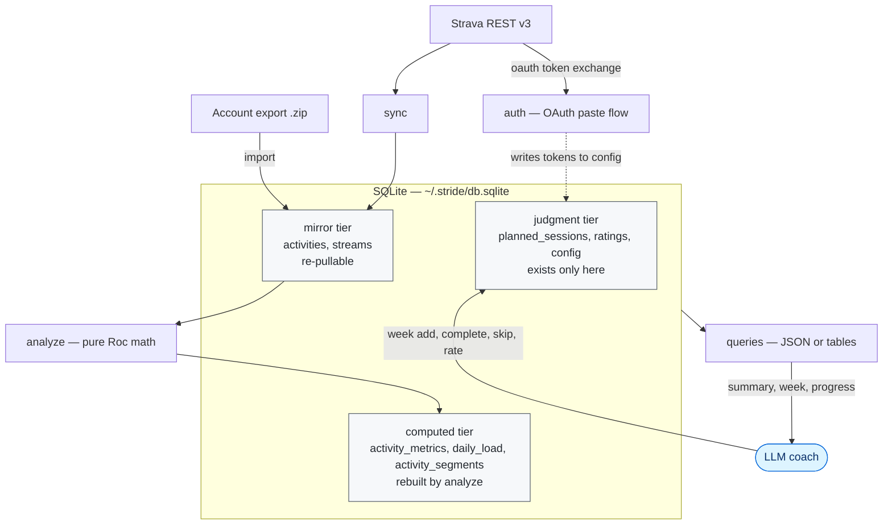

<p align="center">
  
</p>

# stride

[](https://github.com/eschizoid/stride/actions/workflows/build.yml)
[](https://github.com/eschizoid/stride/releases)
[](https://github.com/eschizoid/stride/actions/workflows/build.yml)
[](https://www.roc-lang.org)
[](#the-coaching-layer-optional)
[](#the-coaching-layer-optional)
[](LICENSE)

stride answers the training questions Strava doesn't. Is my training actually polarized?
Is my fitness climbing? When was my last _real_ hard session? Is my FTP stale? It reads
your own Strava history and computes the answers locally, into a SQLite file you own.

Local-first and deterministic, written in [Roc](https://www.roc-lang.org). Strava is one
ingestion layer, not the product. The engine does the math; attach an LLM and it does the
judgment, never the arithmetic.

```terminaloutput
$ stride summary
── stride report (as of 2026-08-17) ──────────────────

  fitness (CTL): 36   fatigue (ATL): 42   form (TSB): -6
  → form -6, up 6 from a week ago — modeled fatigue building, 3 days in this band
  ramp: +0/wk · +2/wk over 28d


  last 28 days:
    21 sessions · 19.1h · 324.9 km
    training load: 1232 (75% measured by power or pace — rest estimated from HR/RPE; see doctor)
    confidence: 75% high · 25% medium · 0% low
    time in HR zones: Z1 211m  Z2 243m  Z3 70m  Z4 263m  Z5 0m
    polarization: 54% easy (Z1-2) / 15% moderate (Z3) / 31% hard (Z4-5)
    ⚠ zone gap: no Z5 heart-rate time in 28 days (could be no hard sessions, or power-based / short intervals that didn't drive HR to Z5)

  FTP (60d): ~239W — derived from your best 20-min power 252W

  sport mix (28d):
    Ride: 10 sessions · 10.8h · 279.5 km · 700 load
    Rowing: 4 sessions · 3.0h · 37.4 km · 269 load
    Workout: 6 sessions · 4.6h · 0.0 km · 220 load
    Run: 1 sessions · 0.8h · 7.9 km · 43 load

  last 7 days: 5 sessions · 4.7h · 70.8 km · 273 load — 73% easy / 8% moderate / 19% hard
  last hard session (5+ min hard, by power or HR): 2026-08-16
  hard days: 1 in 14d · 9 in 28d · median gap 2d
  open planned sessions: 7
```

Every number above was computed locally from your raw activity streams. None of it came
from a model. "Training load" is a _mixed model_: power/HR sessions score in TSS, rated
strength/HIIT sessions in session-RPE, so stride stops calling the blended total "TSS"
and `doctor` breaks it down by per-session confidence.

You need a terminal. (SQLite is linked into the binary. `sqlite3` on your PATH is only
for poking at the database yourself, and for `just test`.) For your data there are two
paths: the free account export (`stride import`, no API app and no Strava subscription)
for summary-level history, or your own Strava API app for live daily sync and full stream
history, which needs an active Strava subscription to hold API credentials. Either way
this is a command-line tool you run yourself, not a hosted service or a phone app.
First-time setup takes about ten minutes.

## Why stride, if I already have Strava?

Strava is the system of record; stride is the analysis layer on top of it. Where they
differ:

- **Deterministic metrics.** TSS, normalized power, intensity factor, CTL/ATL/TSB,
  time-in-zone, derived per-sport FTP. Same inputs, same numbers, every time.
- **A database you own.** Everything lives in `~/.stride/db.sqlite`. Query it with
  `sqlite3`, back it up with `cp`, inspect any computed value's inputs, and read it
  offline after a sync. It also holds your Strava tokens and client secret, so stride
  locks `~/.stride` to `0700` and the db to `0600` (owner-only) on every run, and
  `config get` never prints secret keys.
- **Reproducible recomputation.** Every metric records the inputs it was computed from,
  so a changed input recomputes exactly the affected history. Edit a ride on Strava and
  the metrics self-heal.
- **Scriptable.** Every _query_ command emits JSON for tools and agents when passed `--json`, tables otherwise; `--human` forces tables back. Either flag beats the `STRIDE_FORMAT` environment variable. (`auth` is an interactive browser flow, so it always prints text; `sync` narrates progress on stderr while it runs, but ends in a JSON envelope like everything else.)
- **An honest data model.** A session with no usable data shows `-`, not an invented
  number. Junk HR samples are filtered, and it says so. Strength, HIIT and yoga score
  through your own effort rating (`stride rate`) rather than pretending an aerobic model
  fits them. Every computed load records both which method produced it and a confidence
  tier (high = measured power _or distance-measured pace_, medium = HR or session-RPE,
  low = Strava relative effort), which `doctor` reports as a distribution so you know how
  much of your load is measured and how much is estimated.

### And if I already have a training platform?

TrainingPeaks hides its math. intervals.icu is cloud-locked. Golden Cheetah deserves the
fairest comparison, since it is open source and it does show its work, but it is a dense
desktop GUI built for a human to click through, not an engine a coach can script against.

What none of them do is show their work _to a machine_: every number traceable to its
inputs, recomputable from raw streams, and emitted as versioned JSON a tool can consume.
That is what stride is for. A feature either widens what the engine can honestly measure
or widens who can feed it data. None of them add judgment to the engine — reasoning about
the numbers stays with the coach (ADR 0012).

Ingestion stops at the filesystem. Where a device uploads its data (Garmin Connect,
Wahoo, Peloton's servers) is between you and your vendor. stride reads files you put on
disk: bulk export, USB, email, anything. Strava is the one grandfathered API, because it
already exists and it aggregates. No other vendor-cloud integration ships, ever.

## Installation

Pick a data path:

- **API sync (fullest data — live daily sync + full streams):** a
  [Strava API application](https://www.strava.com/settings/api) (client ID +
  secret — takes two minutes to create). Note: since June 2026, Strava requires
  an active Strava subscription to hold API credentials
  ([their announcement](https://communityhub.strava.com/insider-journal-9/an-update-to-our-developer-program-13428)).
- **Account export (free, no API app):** `stride import <export.zip>` loads the
  archive Strava emails you from Settings → My Account → Download or Delete Your
  Account. Summary-level data only — the export carries no
  streams, so nothing derived from them (normalized power, the power-duration curve,
  interval detection) exists for imported activities. No open issue tracks changing that.

### Prebuilt binary (recommended)

Grab the binary for your platform from the [latest release](https://github.com/eschizoid/stride/releases/latest)
and put it on your `PATH`. Pick one:

| Platform | Asset |
| --- | --- |
| Linux · x86_64 | `stride-linux-x86_64` |
| macOS · Apple Silicon | `stride-macos-arm64` |
| macOS · Intel | `stride-macos-x86_64` |
| Linux · arm64 | `stride-linux-arm64` |
| Windows · x86_64 | `stride-windows-x86_64` |

```bash
# example: macOS Apple Silicon — adjust the asset for your platform
curl -fsSL -o stride https://github.com/eschizoid/stride/releases/latest/download/stride-macos-arm64
chmod +x stride
sudo mv stride /usr/local/bin/          # or anywhere on your PATH (e.g. ~/.local/bin)
stride --version
```

Verify the download against [`SHA256SUMS.txt`](https://github.com/eschizoid/stride/releases/latest/download/SHA256SUMS.txt)
if you like:

```bash
curl -fsSLO https://github.com/eschizoid/stride/releases/latest/download/SHA256SUMS.txt
sha256sum -c SHA256SUMS.txt --ignore-missing   # checks the asset(s) you downloaded
```

### Build from source

Needs `just` and the pinned Roc toolchain. CI installs it with the `roc-lang/setup-roc`
Action; on a laptop, take the `nightly-tag` from `.github/workflows/build.yml` and download
that release from [`roc-lang/nightlies`](https://github.com/roc-lang/nightlies) (the macOS assets are
`roc_nightly-macos_apple_silicon-*` and `roc_nightly-macos_x86_64-*`). Note `just install` symlinks into `~/.local/bin`,
which must exist and be on your PATH:

```bash
git clone https://github.com/eschizoid/stride.git && cd stride
just install        # builds the binary, symlinks it into ~/.local/bin
```

## Quick start

```bash
stride init                                   # create + migrate the db
STRAVA_CLIENT_ID=... STRAVA_CLIENT_SECRET=... stride auth   # one-time browser paste flow
stride config set hr_z1_max 120               # your HR zone upper bounds...
stride config set hr_z2_max 150
stride config set hr_z3_max 165
stride config set hr_z4_max 180               # (z5 = everything above)
stride config set timezone America/Chicago    # optional: anchor "today" to your
                                              # local day (not UTC's). An IANA name
                                              # stays DST-correct automatically.
                                              # Fixed alternative, no DST tracking:
                                              #   `stride config set utc_offset_minutes -300`
                                              # Precedence: timezone > offset > UTC.
                                              # `stride doctor` shows which is active.
stride config set units imperial              # optional: miles and min/mi in the
                                              # human tables. JSON always stays SI
stride sync                                   # pull all activities + all stream history
stride analyze                                # compute everything
```

**On the free path (no API app)?** Replace `auth` + `sync` with a one-shot import
of your Strava account export — `config` and `analyze` are identical:

```bash
stride init
stride import ~/Downloads/strava_export.zip   # summary-level history, no API app
stride config set hr_z1_max 120                # + the rest of the HR zones + timezone, as above
stride analyze
```

`sync` is the only command that pulls data from Strava (`auth` talks to it too, for the
OAuth exchange), and the first one is the whole initial
pull: it fetches your complete activity list, then drains every activity's raw streams,
pacing itself well inside Strava's rate limits: it drains up to 95 reads against the
100-per-15-minute window, then STOPS rather than sleeping, says so, and sets `resumable`.
Run it again in about fifteen minutes and it continues. Strava's daily cap is 1000, so
roughly ten runs a day is the ceiling and a multi-thousand-activity history converges over
a few days of that — hands-off, and never holding your terminal. After that the same command is a two-second incremental. `stride sync --all`
exists only to force a full re-list from scratch.

After `auth`, credentials live in the db — no env vars ever again. Day-to-day:

```bash
stride sync && stride analyze && stride summary   # the daily loop (repo: `just up`)
stride plan                                       # everything needed to plan a week
```

## Commands

Full detail for every command — grouping rules, matching semantics, output
shapes — lives in **[docs/commands.md](docs/commands.md)**.
`STRIDE_FORMAT=json stride --help` is emitted from `Command.specs`, which e2e pins
against the parser's own verb list; it is the authoritative list and this table is the index.

**Setup (once)**

| Command                                         | What it does                                                    |
| ----------------------------------------------- | --------------------------------------------------------------- |
| `init`                                          | create `~/.stride` and migrate the SQLite db — idempotent       |
| `auth`                                          | one-time Strava OAuth; stores tokens and client creds in the db |
| `config`                                        | list the config that is set (secrets redacted)                  |
| `config set <key> <value>` / `config get <key>` | your numbers: HR zone bounds, timezone, units                   |
| `config unset <key>`                            | remove a key outright                                           |

**Data (daily)**

| Command                             | What it does                                                            |
| ----------------------------------- | ----------------------------------------------------------------------- |
| `sync`                              | pull new activities + streams (rolling 30d self-heal); `--all` re-lists |
| `import <zip\|dir>`                 | load a Strava account export — no API creds needed                      |
| `analyze`                           | compute training metrics (TSS, zones, CTL/ATL/TSB)                      |
| `rate <activity_id\|latest> <1-10>` | record perceived effort for a session                                   |

**Reading your training**

| Command                                          | What it does                                                |
| ------------------------------------------------ | ----------------------------------------------------------- |
| `summary`                                        | form, 7d/28d zones + polarization, derived FTP, per-sport   |
| `stats`                                          | career + year-to-date totals per sport                      |
| `doctor`                                         | dataset health: coverage + how each activity was scored     |
| `activities [n] [sport]`                         | recent sessions with metrics (default 30)                   |
| `activity <id>`                                  | one session in depth: zones, bests, hard minutes            |
| `top <metric> [n] [sport]`                       | best by hr, tss, power, intensity, distance, time or output |
| `load [days]`                                    | fitness/fatigue/form series (default 90)                    |
| `zones` (alias `stride pz`)                      | power-zone watt ranges from your derived FTP                |
| `compare [week\|month]`                          | this period vs the one before it                            |
| `season`                                         | training blocks, monthly load, polarization, FTP            |
| `power-curve [days] [sport]` (alias `stride pc`) | power-duration curve + Critical Power                       |
| `pace-curve [days] [sport]` (alias `stride cs`)  | speed-duration curve + Critical Speed; name a sport         |
| `tte <watts>`                                    | how long the CP model says you could hold a power           |
| `reps [date]`                                    | the same workout shape across sessions, rep by rep          |
| `progress [date] [asc\|desc]`                    | trend on a repeated workout, sport-aware lens               |

**Coaching log**

| Command                                                    | What it does                                            |
| ---------------------------------------------------------- | ------------------------------------------------------- |
| `plan`                                                     | planning bundle: summary + open sessions + last 14d     |
| `week` / `week all`                                        | this week's sessions; `all` adds upcoming and last week |
| `week add <date> <type> <detail> <rationale> [target]`     | add a planned session                                   |
| `complete <id> [activity_id]`                              | mark done (bare = rest days only)                       |
| `skip <id> <reason> [activity_id\|none]`                   | mark skipped; `none` releases an existing link          |
| `relabel <id> <type> <detail> [rationale]`                 | fix a session's label, any status                       |
| `event add <date> <name>` / `event remove <id>` / `events` | event targets                                           |
| `project <date> [plan]`                                    | projected CTL/ATL/TSB on a date                         |

Every query command prints **human tables** in a terminal and **JSON** when
`--json` is passed on any command (or `STRIDE_FORMAT=json` for a whole session; the
flag beats the variable, and `--` ends flag parsing for an argument whose literal
value is `--json`). Nothing is inferred from the environment — a machine caller asks.
The JSON is
a versioned envelope: success is `{"schema_version":3,"data":{…}}`, an in-band
error is `{"schema_version":3,"error":{"code":"…","message":"…"}}` — printed on
stdout AND accompanied by exit status 1, so `set -e`, `&&` chains and CI steps
see failures while JSON consumers keep reading the same envelope. A bare `stride` prints
help and exits 0 — machines get `{"data":{"commands":[…]}}` instead. An unknown command
is an error. Malformed invocations print a targeted `usage:` line for humans and a
`{"error":{"code":"usage",…}}` envelope for machines; both exit 1.
`stride --help` is the full one-screen manual.

The contract is a checked-in artifact, not prose: `schemas/v3/*.json` describes every
published payload plus the envelope (including its error-code vocabulary) (required keys, types,
enum values, and — via `additionalKeys: false` — the keys that are NOT part of the
contract), and `tools/validate.jq` checks a payload against one. `just schema-check`
validates your own database against them. `just schema-check` runs it
against your own database; the e2e suite runs it against fixtures in CI, together
with mutation checks proving the validator rejects a missing key, a wrong type, an
undeclared key, and a bad enum value.

The tables put the load model's honesty on screen. A `-` is never a zero: it means no
usable data for that column, not that the value was nothing.

```terminaloutput
$ stride activities 4     # example output
╭────────────┬─────────┬────────────────────────────────────┬──────┬──────┬────────────────┬──────╮
│ date       │ sport   │ name                               │ time │ load │ intensity (if) │ hard │
├────────────┼─────────┼────────────────────────────────────┼──────┼──────┼────────────────┼──────┤
│ 2026-08-16 │ Ride    │ 45 min Metallica Ride with Kendall │ 45m  │ 82   │ 1.05           │ 36m  │
│            │         │ Toole                              │      │      │                │      │
│ 2026-08-15 │ Ride    │ Morning Ride                       │ 103m │ 65   │ -              │ 1m   │
│ 2026-08-14 │ Workout │ Evening Workout                    │ 45m  │ 38   │ -              │ 0m   │
│ 2026-08-12 │ Run     │ Morning Run                        │ 46m  │ 43   │ -              │ 0m   │
╰────────────┴─────────┴────────────────────────────────────┴──────┴──────┴────────────────┴──────╯

load:           session stress — TSS for power/HR, session-RPE for rated sessions; '-' = no usable data (e.g. dead HR strap)
intensity (if): vs your FTP — ~0.7 easy · 0.85-0.95 tempo · ~1.0 threshold · 1.05+ vo2max
hard:           minutes at/above threshold — by power (vs the sport's FTP), else the pace split, else HR Z4+Z5
```

Reading it: the Peloton ride has a power meter, so it gets an intensity factor and 36
minutes measured at or above threshold _by power_. The outdoor ride has no power, so
`intensity` is `-` rather than an invented number — but it does have a distance stream, so it is scored
by **pace** (an `rtss` ride — the ladder below explains the rung), and its 1 minute of hard
time comes from the pace intensity split, not from HR zones. The strength session scores a
`load` from your own session-RPE rating (`stride rate`) with no intensity factor at all,
because an aerobic model does not fit it.

## The coaching layer (optional)

The repo ships an agent skill at
[`skills/stride/`](skills/stride/SKILL.md), written for any agent rather than one
vendor. Claude Code picks it up automatically inside a checkout, through a tracked shim
at `.claude/skills/stride/` that only redirects there (e2e pins the shim's routing
description byte-equal to the canonical one, so the two cannot drift apart). For any
agent outside a checkout, install the one canonical copy into whatever directory that
agent reads skills from.

Codex reads `$CODEX_HOME/skills` (default `~/.codex/skills`), and its built-in
skill-installer can fetch straight from GitHub, so the easiest route is to ask Codex
itself: "install the skill from this repo" with the repo name and the `skills/stride`
path. Claude Code reads `~/.claude/skills`. Either way the manual route is the same
plain shell — copy or link the directory into the agent's skills directory. If the
destination already exists as a real directory (an earlier copy), remove it first:
`ln -sfn` against a real directory exits 0 and silently nests the link inside it.

```sh
mkdir -p ~/.claude/skills && ln -sfn "$PWD/skills/stride" ~/.claude/skills/stride
mkdir -p ~/.codex/skills  && ln -sfn "$PWD/skills/stride" ~/.codex/skills/stride
```

Restart the agent afterwards to pick it up. Whether every agent follows a symlinked
skill directory is untested — if a linked skill does not appear after a restart, copy
the directory instead.

The repo also carries a Codex plugin manifest — `.codex-plugin/plugin.json` declares the
skill under the name `stride`, and a marketplace entry pointing at a checkout makes it
installable via `codex plugin add`. The manifest's `skills` path is `./skills/`, the same
canonical directory both install routes copy from, so there is no second copy in the repo
for them to disagree via — an installed snapshot still only updates when reinstalled.
The LLM computes
**none** of the metrics — it reads the engine's JSON, reasons about it in natural
language, and writes its planned sessions back through the coaching-log
commands:

1. `stride sync && stride analyze`
2. `stride plan` → reason about polarization, zone gaps, form, sport balance
3. reconcile: match the open plan to completed activities → `stride complete`
4. plan: `stride week add` the coming week (re-planning a date revises its open
   session in place — same id, no tombstone; `skip` is for sessions that were
   going to happen and didn't)
5. sessions that didn't happen get `stride skip <id> "<reason>" [activity_id]` — adherence
   history stays honest
6. a wrong label on any session — done ones included — gets
   `stride relabel <id> <type> "<detail>"`; links, status and metrics stay put

The planned-sessions table is what lets the next session adapt: the coach can see what
it asked for and what actually happened. Without an LLM everything still works, since
the human tables carry the same numbers, legends and verdicts.

## Architecture



The three tiers exist because they have three different recovery stories. Mirror is
replace-on-sync and re-pullable, computed rebuilds from `analyze`, and judgment exists
nowhere else. Human input never lives on a mirror table, because a re-sync would
silently wipe it.

**What the engine computes** (all deterministic):

- **TSS ladder** — best available data wins, in this order:
  1. **Measured power**, as a group: stream normalized power → Strava weighted watts →
     average watts. The whole group is skipped when Strava marks the watts estimated
     (`device_watts: false`) — an estimate is not a measurement — and also when the sport
     has no derived FTP yet, since scoring against an FTP of 0 would compute a TSS of 0
     _and_ block every rung below it.
  2. **Pace** (rTSS), for any sport with a usable distance stream, once that sport has a
     derived 20-minute threshold speed. Altitude is optional: with it the pace is
     grade-adjusted, without it raw speed scores. This is why a meterless outdoor ride
     scores by pace rather than falling to HR — dozens of rides in this database do.
  3. **A fallback whose order depends on the sport's class**: endurance sports take
     HR → session-RPE → `relative_effort`; strength-class sports put the athlete's own
     **session-RPE ahead of HR**, because a heart rate says little about a lifting session.
     (The HR rung itself is zone-weighted hrTSS where zone seconds exist, else the whole
     moving time placed in the zone the average HR falls in — a separate `load_model`.)
  4. **Honest zero** if nothing above applies.

  Each row records which rung scored it in `load_model`; the confidence tier is
  derived from that at read time rather than stored.

- **Normalized power** — 30-second rolling average over 1 Hz-resampled streams.
- **Grade-adjusted pace (rTSS)** — for any sport with a distance stream, a pool swim included: normalized graded
  pace vs a **derived** per-sport threshold pace (best 20-min graded speed × 0.95), used
  when power isn't available. Sports without a distance stream fall through to HR.
- **Power-duration curve + Critical Power** — best power held at every duration (5 s–60 min)
  across a window, plus a CP/W′ fit. Surfaced by `power-curve`.
- **CTL/ATL/TSB** — 42-day and 7-day exponential moving averages of daily load,
  extended through **today** so rest days decay fatigue and `form` is true as-of-now.
- **Zones are HR-based** — one global set (`hr_z1_max`…`hr_z4_max`) with optional
  per-sport overrides (`hr_z2_max_rowing`). Power never feeds the zone table, but it does
  drive TSS/NP, the power-duration curve and CP/W′, the derived FTP, and the easy/moderate/
  hard intensity split that the `hard` column reports.
- **FTP is derived, never configured** — the sport family's best 20-min power × 0.95 over a
  60-day window, and the window is anchored to **the activity's own date**, not today. A
  2021 ride is scored against 2021 fitness, and a new personal best does not rewrite your
  history ([ADR 0005](docs/adr/0005-period-accurate-ftp.md)).

### What gets computed per sport

Nothing here is a hardcoded sport list. The data you have decides the rung: the ladder
takes the best available source and records which one won in `load_model`, so `doctor` can
show you the distribution. Sport type changes four things, all of them in `Sports.roc`,
but only one of them is a table of rows: the other three are a list literal and two
name-substring predicates. Those four are the FAMILY (which
since #151 is the population the derived FTP is computed over, not just a display filter),
pace routing for interval detection and decoupling, whether a rating outranks heart rate,
and the pace-TSS exponent.

| Sport | Load scored by | Also computed |
|---|---|---|
| **Ride / VirtualRide / GravelRide / MountainBikeRide** | power stream → NP·IF (`power_stream`), else Strava weighted watts, else avg watts | power-duration curve + CP/W′, 20-min best → derived FTP, power-intensity split |
| **Rowing** | same power ladder — a rowing watt is not a cycling watt, so it gets its **own** derived FTP | as above, on its own threshold |
| **Run** | grade-adjusted pace (`rtss`): normalized graded pace vs derived threshold pace, **IF²** | Minetti grade adjustment, pace-intensity split |
| **Swim** | grade-adjusted pace (`rtss`) with **IF³** — drag rises with v³, so squaring under-scores hard sets by ~20% | flat-altitude speed, CSS-equivalent threshold |
| **WeightTraining · Workout · Crossfit · HighIntensityIntervalTraining · Yoga · Pilates** | your **session-RPE** first (`hours × RPE × 10`), then HR | — |
| Anything with only HR | zone-weighted hrTSS (Friel 30/55/70/80/100 per hour) | HR zone seconds |
| Anything with none of the above | Strava `relative_effort`, else an honest **zero** | — |

Two consequences:

- **Strength sessions need a rating to score honestly.** A junk HR strap gives them a
  near-zero load, which is truthful "no data" rather than "no effort". `stride rate <id> <1-10>`
  is what turns that into real load, and `doctor` lists the unrated ones.
- **Every threshold is self-derived**, per family for power and per sport for pace. A
  GravelRide scores against the whole ride family's FTP (same muscles, same meter, #151);
  pace thresholds stay exact-match because surface changes what a speed means. Add a new
  sport and it starts scoring as soon as it has the data. There is nothing to configure.

How it stays correct without being told to:

- Every metrics row stores what it was scored with: the FTP and the derived threshold
  pace in force on that activity's
  date, the HR zones, and the activity's own inputs. So `analyze` recomputes exactly the
  rows whose inputs actually changed, and nothing else.
- Edit a ride on Strava and the next `analyze` notices and rescores it. `sync`
  itself never discards computed work: it re-lists a rolling 30-day window every
  run and cannot tell an edit from a no-op.
- The schema versions itself. Upgrading the binary against an existing db migrates on
  the next command.

The decisions behind all of this (why Roc and why pinned, the effects-only module
layout, the three data tiers, the mixed-model load, the versioned JSON envelope, and
the Windows/compiler-migration situation) are recorded in
[`docs/adr/0000-architecture.md`](docs/adr/0000-architecture.md).

## Development

```bash
just test      # pure expects (Metrics, Render, Command, Config, …) -> build -> e2e
just build     # the binary (--opt=dev; see AGENTS.md for why)
just install   # build + symlink into ~/.local/bin
```

- **Toolchain:** Roc's new (Zig) compiler, pinned by exact nightly tag in the workflow
  files · [basic-cli 0.22](https://github.com/roc-lang/basic-cli) · builtin JSON. `roc
check`, `roc test` and a full `roc build` all work. Install the pinned compiler the way
  CI does, via the `roc-lang/setup-roc` Action with the `nightly-tag` from
  `.github/workflows/build.yml`; locally, download that tag from `roc-lang/nightlies`. **`AGENTS.md` is the maintained source
  for build and test conventions**; this section is a summary and defers to it.
- **Layout:** effects live in modules by concern — `Db.roc` (SQLite + migrations),
  `Strava.roc` (OAuth + sync), and the `Analyze.roc` / report family / `Plan.roc` /
  `Import.roc` command modules; `app.roc` is a thin argv → dispatch shell. Pure, tested
  modules: `Metrics.roc` (math), `Render.roc` (tables/formatting), `Command.roc` (argv →
  typed command parser), `Config.roc` (secret-key policy), `Sports.roc` (the sport
  vocabulary — families, class, pace routing and the pace-TSS exponent, gathered in one
  module rather than if-chains scattered through others),
  `Streams.roc`, `Csv.roc` and `Backfill.roc`. `Output.roc` (the JSON envelope and
  `json_schema_version`) and `Schema.roc` (DDL) are effectful and DDL respectively — both
  type-checked rather than expect-tested. Query
  strings live next to their row decoders on purpose — the compiler can't check SQL
  aliases against decoders, so cohesion is the safeguard.
- **Tests:** pure `expect` blocks across eight modules, run by `just test`. No count is
  quoted here — it would rot on the next commit that adds a test, `roc test`'s per-module
  numbers overlap each other, and the app-wide run adds ~207 expects belonging to the
  basic-cli platform rather than to stride. Plus an
  end-to-end suite (`just e2e`) that runs the real
  binary against a sandboxed `HOME` with seeded activities of known math (power TSS ~111
  from NP 200 against a derived FTP of 190, hrTSS ~55, derived-FTP family inheritance,
  full plan lifecycle, the
  versioned JSON envelope, timezone precedence, power-spike filtering, migration
  from a legacy db, error contracts, corrupt-data resilience). A separate
  `just e2e-sync` runs that same `tests/e2e.roc` in two roles — a mock Strava server
  (`E2E_MODE=mock`) and a sync driver — to exercise the real sync + token-refresh
  path network-free.
- **CI:** on every push, `roc check` plus every pure module's expects on Linux, macOS and
  Windows; then a macOS job that builds the binary (`--opt=dev`) and runs the e2e suite.
  The compiler is installed by `roc-lang/setup-roc` and pinned by exact nightly tag —
  nine times across four workflow files, so `grep -rln nightly-tag .github/workflows`
  before calling a bump done.

## What's next, and what never ships

What is next lives in [GitHub issues](https://github.com/eschizoid/stride/issues). Why it
is built the way it is lives in [`docs/adr/`](docs/adr/), and the list of things stride
deliberately will not do is [ADR 0000 §10](docs/adr/0000-architecture.md). That is the
only copy of the list, on purpose.

A personal daily driver, built for one athlete, open to anyone who brings their own
Strava app credentials.
