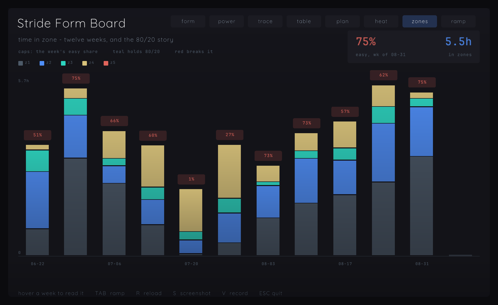
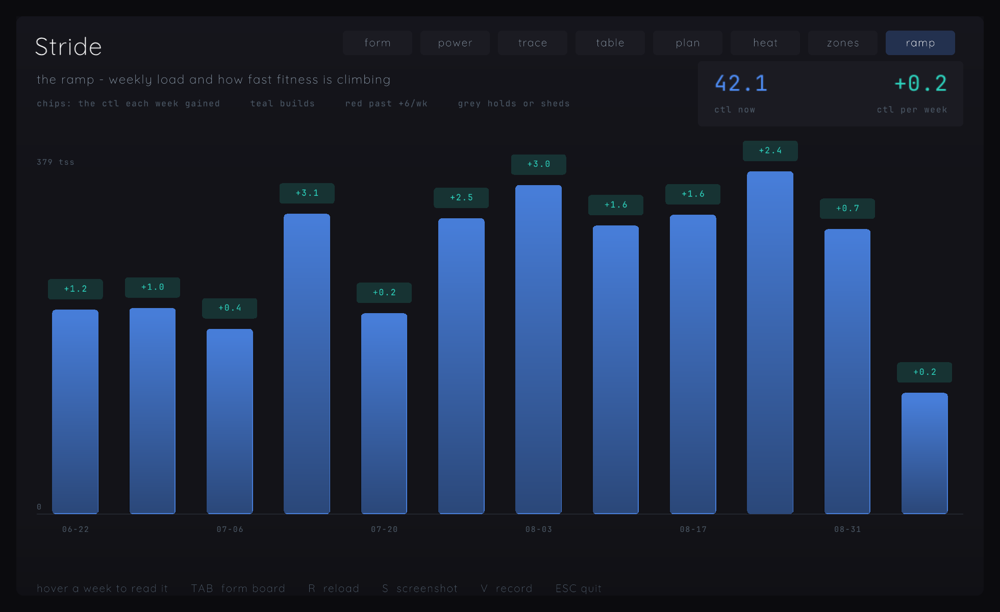
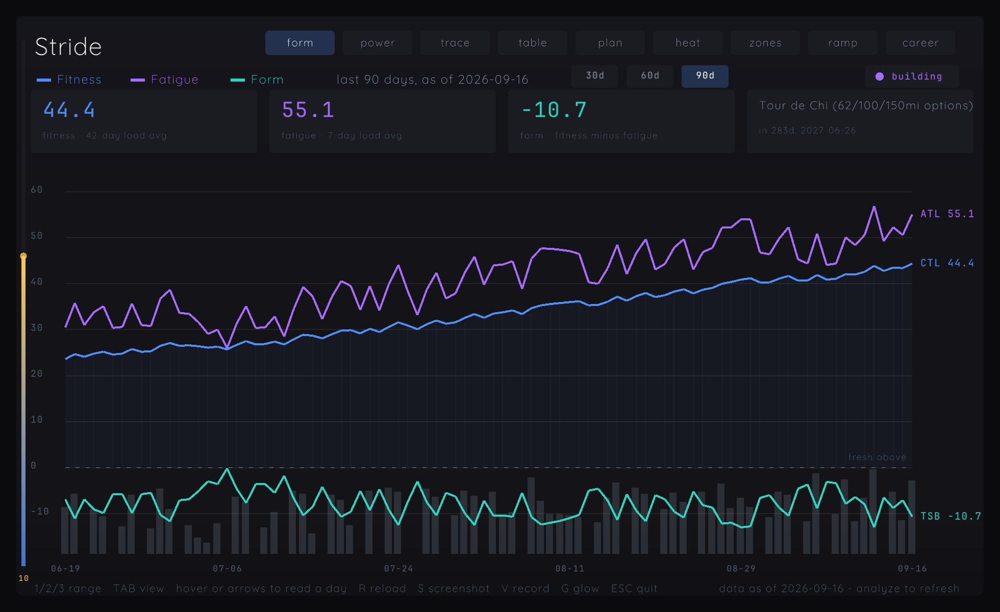
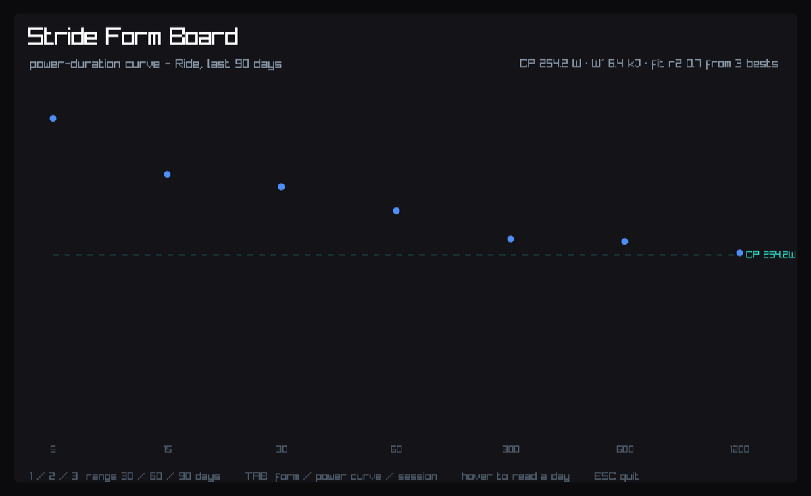
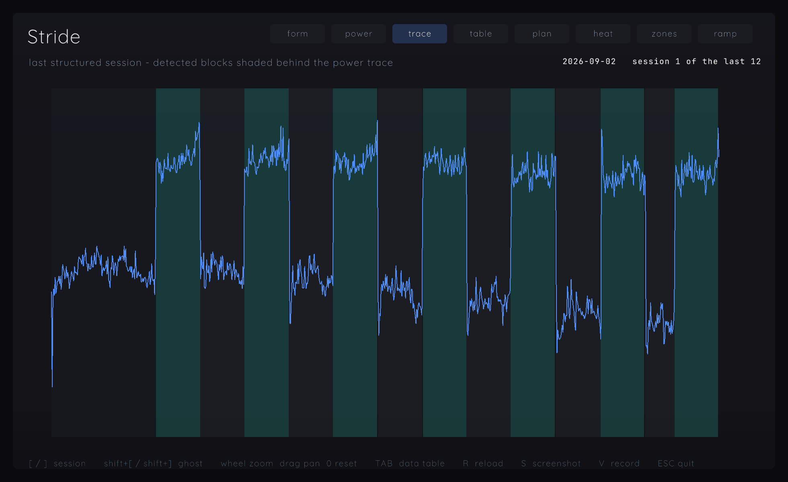

# The app window — `src/viz/`

A native window over the engine's PMC series, read at launch from
`~/.stride/db.sqlite`. This is ADR 0015 made real: pixels for the human, state
for the coach, the database as the bus. The window is a *second consumer* of
the SQLite — no export step, no baked data, nothing the CLI has to prepare.

## What it shows

- **Fitness** (CTL, blue, filled), **fatigue** (ATL, violet), **form** (TSB,
  teal — the brand accent) over the selected range.
- Daily load (TSS) as a rug along the bottom, on its own scale.
- Y-axis labels, current values at the line ends, and the next planned event:
  a dashed in-plot marker when its date is inside the plotted window, or the
  event tile's countdown (in the KPI row) when it is beyond it. A future event
  usually takes the tile form — the series ends on the last analyzed day, so
  there is rarely a column to mark.

## What the form board shows

Big-number tiles carry the artifact's reading aids: fitness, fatigue and form
with their one-line meanings, plus an event slot that counts down to the next
event, says "ridden" for up to a week after one, and names the add command
when none is planned. The subtitle always carries the as-of day, and the TSB
zero rule is captioned "fresh above". The fourth TAB view is the artifact's
data table, with as many rows as the window height holds.

## The plan view

The fifth TAB stop answers "what do I do today" without asking anyone: the
prescribed session and its rationale in a card, the week's ladder with type
chips and done/today/upcoming states, this week's load beside last week's,
and the coach corner - the newest bus directive, on screen. Steerable like
everything else: a directive with view 4 opens it.

## The heat view

The sixth stop is a year of training at a glance: a contributions-style
calendar, one cell per day, Monday-started weeks as columns, cell intensity
scaled to the biggest TSS day in the shown window. As many weeks as the
window width holds, newest at the right edge, month ticks along the top.
Event days already ridden wear a white ring (the grid is history; the
plan view carries the coming one). Hovering a cell reads the
day back - date, TSS, and the session note when there is one. A directive
with view 5 opens it.

## The zones view

Twelve Monday weeks of time in zone as stacked bars, each capped with that
week's easy share - teal when it holds the 80/20 line, alarm red when it
does not. One chart, one scale: the share reads across the row of caps, so
no second panel is needed to plot it. The card names the latest week that
carried training. The intensity classification comes from the
`activity_intensity` view, which carries the same per-activity split
`stride summary` computes, so the window and the CLI share one definition
of easy and hard. A directive with view 6 opens it.



## The ramp view

The overtraining early warning, also one chart: weekly TSS as gradient
bars, each wearing a chip with the CTL that week gained. The ramp is
encoded as the chip's COLOR on the bars' own axis - teal builds, red past
+6/wk, grey sheds - rather than as a second y-axis, because two scales
sharing a plot is a lie no legend repairs. The card carries where fitness
stands and how fast it is moving; a week with no load keeps a base stub, so
the current partial week never vanishes from the row. A directive with view
7 opens it.



## Controls

| key / gesture | effect |
|---|---|
| `1` / `2` / `3` | range 30 / 60 / 90 days (form board) |
| `←` / `→` | walk the day cursor (form board; ← older, → newer, past newest turns it off) |
| `R` | reload everything from the database without reopening |
| `G` | toggle the glow pass - the scene renders offscreen and its bright parts come back blurred and added on top; if the GPU refuses any of it, the app draws exactly as before the pass existed |
| `V` | toggle a WebM recording of the screen into `./captures`, named for the view it started on; FixedStep timing, so the same data replays to the same file |
| nav pills (top right) | click any view directly; the active one is filled - each wears its vector mark, drawn from primitives (no sprite sheet, crisp at any DPI) |
| `TAB` | cycle views: form board / power view / session trace / data table / plan / heat / zones / ramp |
| `1` / `2` / `3` or the chips (power view) | re-window the blue ladder and CP fit to 30/60/90 days |
| `shift+[` / `shift+]` (trace view) | summon / walk / dismiss the ghost overlay (past newest = off) |
| wheel / drag / `0` (trace view) | zoom anchored at the cursor's moment, pan while held, reset - the window is [pan, pan+1/zoom] of the session |
| `[` / `]` (trace view) | older / newer structured session, last 12 - every one is cached at load, so a switch is a memory read, not a query |
| `←` / `→` (table view) | scroll the window through the whole series (rows fill the window height) |
| click a date (table view) | open that day's detail panel: sessions, minutes, km, TSS, NP |
| window edges | drag to resize; every view reflows live (980x600 floor) |
| `S` | save a PNG of the current view into `./captures` |
| mouse hover | crosshair + per-day dots + a top-right readout (form board) |
| `ESC` | quit |

## Running it

```
just viz          # opens the window
just viz-check    # type-check only, no window
just viz-app      # installs ~/Applications/Stride.app
```

## Installing the released app

Releases attach `stride-app-macos-arm64.zip` and
`stride-app-macos-x86_64.zip` — the whole `.app`, brand fonts inside
it, built from the tagged commit and verified for architecture, signature
and fonts before it is packaged. A zip missing from a release means its
build job failed; `just viz-app` builds the same bundle locally. Unzip
anywhere and launch.

A downloaded copy carries macOS's quarantine flag, and only its binary is ad-hoc
signed — no Developer ID, no notarization — so Gatekeeper refuses the
first launch. Clear the flag once, pointing at wherever you put it:

```
xattr -dr com.apple.quarantine "/Applications/Stride.app"
```

A bundle built locally was never downloaded, so it carries no such flag.

On first launch the bundle copies its fonts to `~/.stride/fonts`. Failed
copies are logged to `~/.stride/fonts-seed.log`; if the directory itself
cannot be created, the window falls back to its default font.

The viz pins **its own compiler** — roc-ray's platform needs
`nightly-2026-08-23-fb208ba`, not the engine's pin. The pin lives in the app header of
`src/viz/main.roc`; point `ROC_VIZ` at a matching nightly if your PATH `roc` is the
engine's. CI checks it in its own job (`viz-check` in `build.yml`) with that
same tag.

## Typography

Quicksand (the wordmark's rounded face) carries prose — titles, legends,
captions, hints. JetBrains Mono (the tagline's voice) carries data surfaces —
KPI digits, axis ticks, readouts and the table, mixed words included, so a
data line never switches face mid-string. Both ship in `assets/fonts/` (OFL) and
the app bundle copies them to `~/.stride/fonts`; when neither location
answers, the platform default font appears instead of a crash.

## The coach's seat (ADR 0015's bus)

The window is steerable and observable through two tables it maintains in the
same database — no sockets, no protocol, just SQL:

```sql
-- a coach writing before the window's first launch creates the table too
-- (the window runs the same DDL; IF NOT EXISTS makes the race harmless):
CREATE TABLE IF NOT EXISTS viz_directives (
  id INTEGER PRIMARY KEY AUTOINCREMENT,
  created_at TEXT NOT NULL DEFAULT (datetime('now')),
  view INTEGER, range INTEGER, cursor_day TEXT, trace_day TEXT,
  ghost_day TEXT,
  consumed INTEGER NOT NULL DEFAULT 0);

-- steer: the window polls ~1/s, applies the newest unconsumed row, and
-- consumes everything up to it. NULL fields mean "leave that alone".
INSERT INTO viz_directives (view, range, cursor_day, trace_day, ghost_day)
VALUES (0, 30, '2026-09-02', NULL, NULL);
-- view 0..7 (form/power/trace/table/plan/heat/zones/ramp). A directive
-- naming the retired view 8 leaves the VIEW unchanged (the record book
-- merged into the power view at 1); its other fields still land, because
-- every directive field applies independently - NULL means leave alone,
-- and that contract does not change when one field is out of range. range 30|60|90 lands on the view the
-- directive lands on: named view if set, else the visible one — on the power
-- view it re-windows the ladder+fit, on every other view it sets the form board's
-- range.
-- cursor_day parks the crosshair, trace_day picks the session.
-- ghost_day overlays a second session on the trace view at reduced alpha
-- (same watts scale, same seconds-per-pixel); the literal word 'none'
-- dismisses the ghost. A database that predates the column gains it on
-- the window's first poll (ALTER TABLE, failure-on-present discarded).

-- the window creates this too; a coach may pre-create it the same way:
CREATE TABLE IF NOT EXISTS viz_focus (
  id INTEGER PRIMARY KEY CHECK (id = 1),
  updated_at TEXT NOT NULL,
  view INTEGER NOT NULL, range INTEGER NOT NULL,
  cursor_day TEXT, trace_day TEXT, ghost_day TEXT);

-- observe: one row, upserted when what the human sees changes (throttled ~2/s)
SELECT view, range, cursor_day, trace_day, ghost_day, updated_at FROM viz_focus;
```

A directive is consumed as read — one the window crashes on is dropped, never
replayed against a stale model. Focus writes are throttled (~2/s at most) and
only fire when what the human sees actually changed.

## Boundaries this nightly imposes

- No F64→F32 narrowing exists, so the SQL query CASTs to integer tenths and
  the app divides by 10 — the numeric boundary belongs to SQL.
- No Env module on the platform; `HOME` is read by capturing `printenv` output
  through `Cmd` — on every load, which means at launch and again on each `R`.
- `has` is a reserved word; uppercase identifiers are types.

## The power view (TAB)

A second screen, and the one that answers "where am I against my best":
the window's power-duration ladder (blue) drawn over the all-time record
envelope (grey), eight rungs from 5s to 60min. The gap at each rung is
printed in watts right where it lives; a rung whose window best IS the
record collapses to one teal dot marked "pr". Hovering a rung reads back
the record, the day it was set, and the window's value. The CP fit
reports from the bottom-right status corner, its dashed line on the chart.

The **points** come from the stored per-activity bests (`activity_metrics.best_*_w`),
maxed over the window. `CAST(ROUND(...))` matters — a bare `CAST` truncates and
draws the whole ladder a watt low, which was caught by diffing all seven rungs
against `stride power-curve 90 Ride --json`.

**CP, W′ and r2 come from the engine**, not from a second regression here. The fit
is `Metrics.hyperbolic_fit`'s job and a copy in the viz would drift from it, so the
view shells out to `stride power-curve --json` and extracts each field
independently — key ORDER cannot silently break the parse, and a missing field
shows "CP fit unavailable" rather than a fit of zeros.

Rungs are spaced by INDEX rather than by duration: the ladder is a fixed 5s..20min
set, and a linear time axis piles the six short rungs onto the left edge.

## Session trace view (TAB)

The third screen: the most recent session that has detected work blocks, drawn as
its power trace with the detector's blocks shaded behind it — work in the accent,
recovery and warm-up/cool-down in grey.

This is the view #372 calls "auditable". A table of segments can tell you the
detector found seven work blocks; only the overlay tells you whether a block
started before the power did.

The trace is **downsampled in SQL** to ~800 points. A 45-minute ride carries ~2700
samples against ~830 pixels of plot, so drawing all of them costs three line
segments per pixel and shows nothing more. `json_each` reads the stored stream
directly — SQLite has JSON1, and this platform has no JSON decoder.

Both axes divide by the SAME duration, taken from the stream's last timestamp.
Deriving it from the segments instead would stretch partial detector coverage
across the full width; on the reference activity the two differ by one second in
2700, which is sub-pixel and would have hidden the bug rather than shown it.

## Screenshots (S)

`S` writes a PNG of the current view into `./captures`, named for the view.
Reference captures of all three live in `docs/img/`.

These are how the agent reviews its own rendering. Every value drawn derives from
JSON the coach already reads losslessly, so a frame is worthless for judging
TRAINING — but it is the only way to see whether the drawing itself is right.
Adding this key immediately surfaced five defects in code that had type-checked
and had every data path diffed against the engine: a legend overprinting two
other views' titles, an em dash rendering as `?`, colliding axis labels, a count
shown as `3.0 bests`, and a CP asymptote described in a comment and never drawn.






